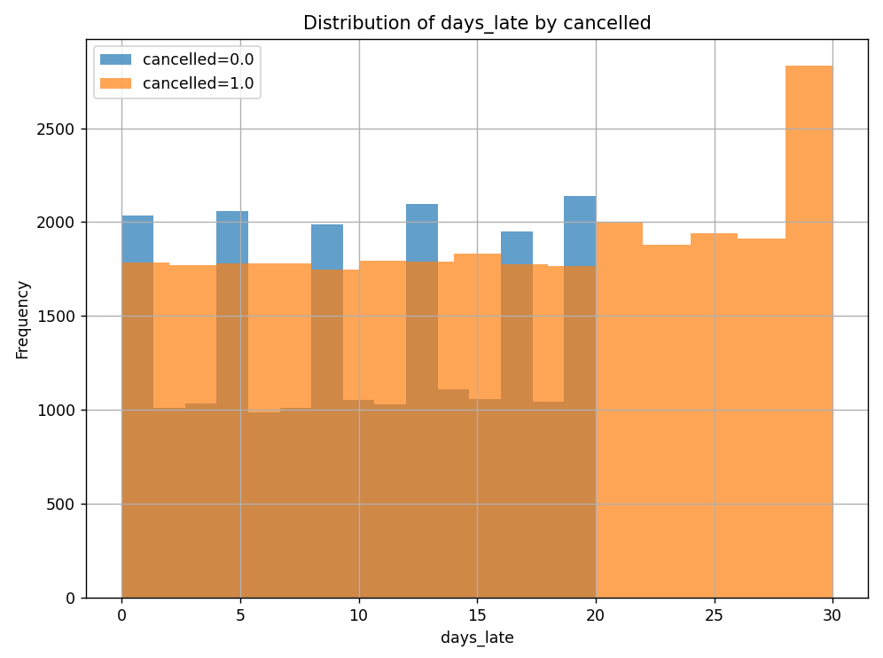
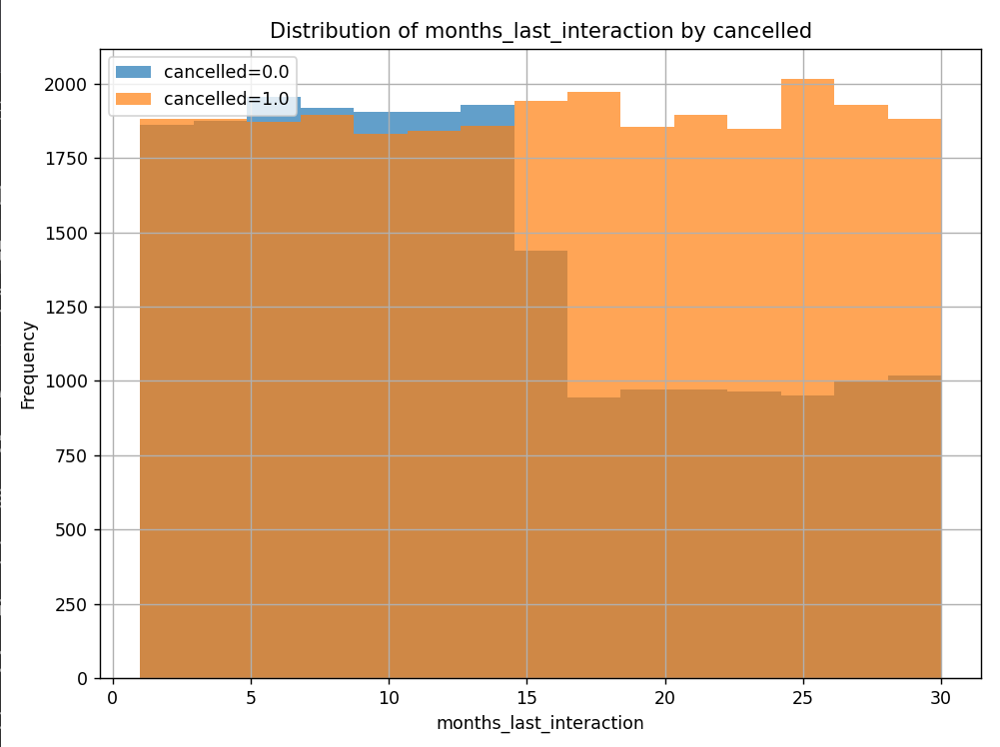

# Customer Churn Analysis

This project analyzes customer churn data, providing insights into cancellation patterns using visualizations. The dataset is processed, cleaned, and visualized using Python libraries such as **pandas** and **matplotlib**. 

## Features
- Load and clean a customer churn dataset.
- Display a summary of churn statistics.
- Generate histograms for all dataset columns with visual differentiation based on churn status.

Installation

1. Clone this repository:

```bash
git clone https://github.com/vallz0/customer_churn_analysis.git
cd customer_churn_analysis
```
2. Install the required dependencies:
```bash
pip install -r requirements.txt
```
3. Add your dataset:
- Place your CSV file (``cancellations.csv``) in the project root directory.
- Ensure it has the following columns: ``CustomerID, age, gender, customer_lifetime, usage_frequency, callcenter_calls, days_late, subscription, contract_duration, total_spent, months_last_interaction, cancelled``.


## Requirements

- Python 3.8+
- Libraries: pandas, matplotlib

## Preview

### Output:
```
Summary of the 'cancelled' column:
cancelled
1.0    56.8%
0.0    43.2%
Name: proportion, dtype: object
```
### Graphics:





